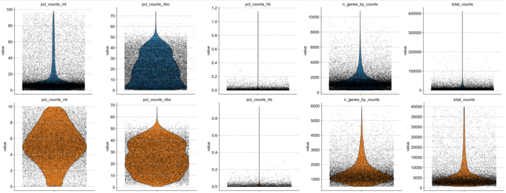
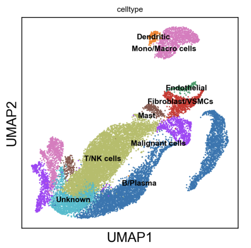
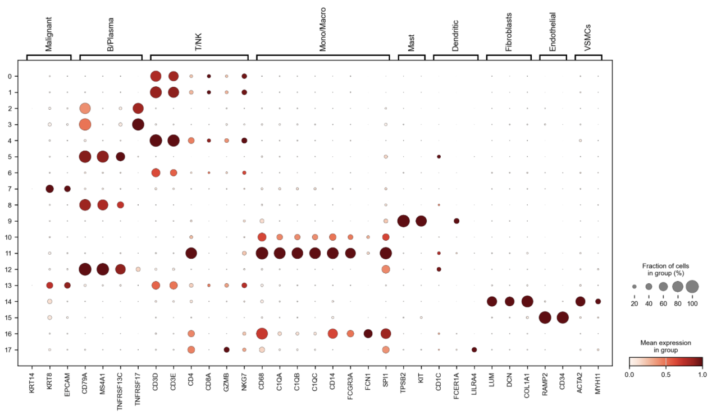

# 单细胞 RNA-seq 分析流程（基于 Scanpy）

本项目基于 Scanpy 实现了一个**标准的单细胞转录组（scRNA-seq）分析流程**，涵盖从数据预处理到细胞类型注释的完整步骤。

该项目的主要目的是：**梳理并复现单细胞分析的核心流程，并以结构化方式整理分析结果**。

---

## 📌 项目概述

本 notebook 覆盖以下关键分析步骤：

- 多样本数据整合
- 质量控制（QC）
- 双细胞检测（Scrublet）
- 数据标准化与对数转换
- 高变基因筛选（HVG）
- 细胞周期评分与回归
- 降维（PCA / UMAP）
- 聚类分析（Leiden）
- marker 基因分析
- 差异表达分析（DEG）
- 细胞类型注释

---

## 📊 分析结果

项目的主要结果已整理为报告文件：

- 📄 **完整分析报告（PDF）**  
  👉 `results/report.pdf`

以下为部分代表性结果展示：

### 1. 质量控制（QC）
- 基于基因数、UMI数、线粒体比例等指标进行过滤
- 展示过滤前后数据分布变化



---

### 2. UMAP 降维结果
- 使用 Leiden 算法进行细胞聚类
- 在低维空间中可观察到不同细胞群体的分离



---

### 3. Marker 基因表达
- 利用经典 marker 基因对不同 cluster 进行特征分析
- 为后续细胞类型注释提供依据



---

## 🧪 分析流程说明

### 1. 数据整合
- 合并多个样本为统一的 `AnnData` 对象
- 统一细胞命名，避免重复
- 标注线粒体、核糖体、血红蛋白相关基因

---

### 2. 质量控制（QC）

主要指标：

- `n_genes_by_counts`
- `total_counts`
- `pct_counts_mt`
- `pct_counts_ribo`
- `pct_counts_hb`

过滤条件：

```python
n_genes_by_counts > 500
n_genes_by_counts < 6000
total_counts < 40000
pct_counts_mt < 10
pct_counts_ribo < 70
pct_counts_hb < 1
